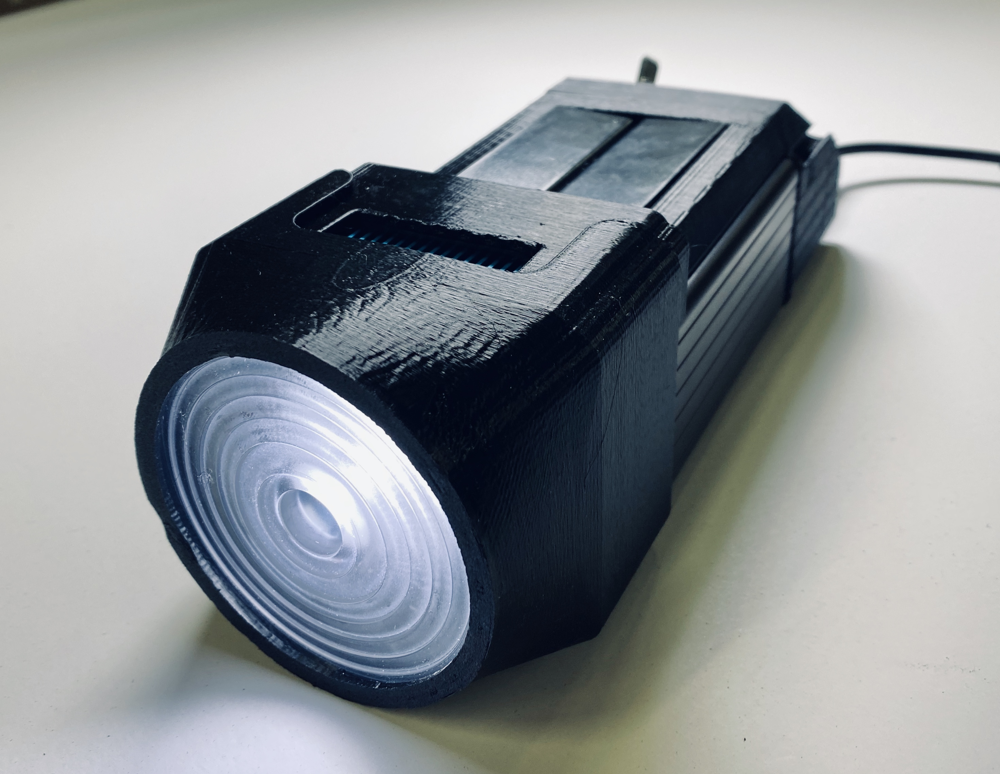
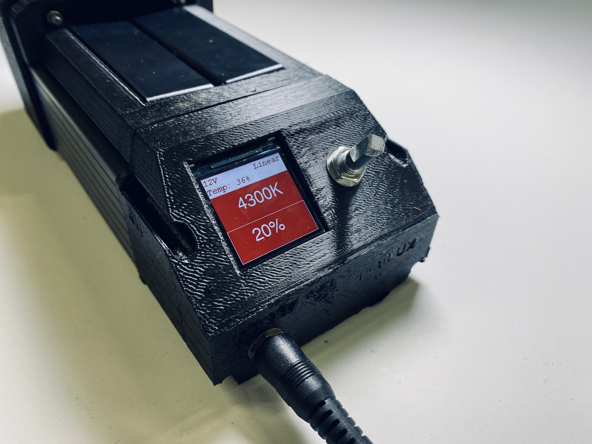
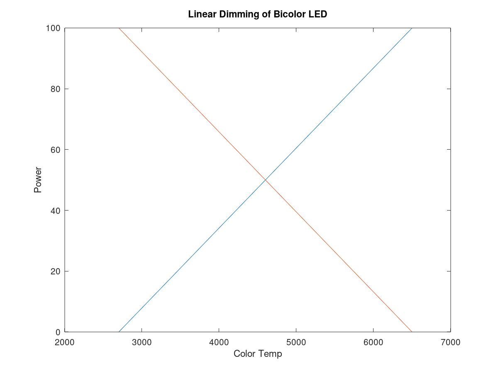
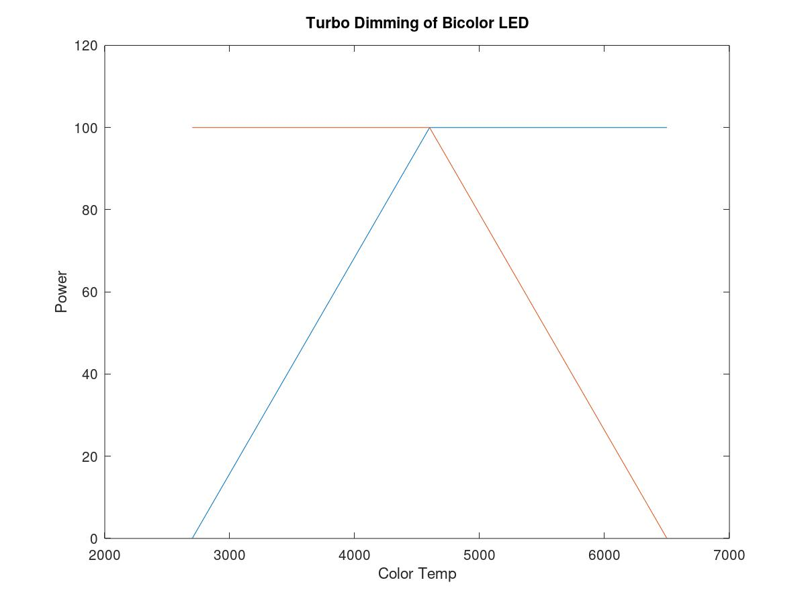
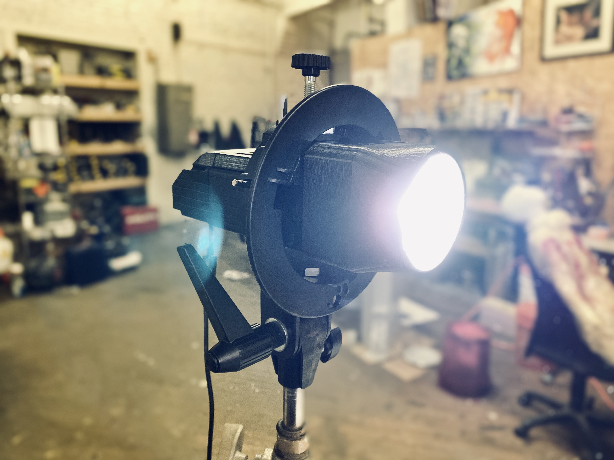

# OpenLUX LED Film Light
 
The OpenLUX Light is a high-CRI, flicker-free, bicolor LED light intended for film and video use. It's small enough to fit in a Bowens mount flash adaptor, letting it accept accessories like soft boxes and reflectors. 

Fusion 360 Assembly: https://a360.co/2Nx0XiO

The light features a CTM-22 COB LED module.

###### Features:

 - Bowens mount compatible
 - Accepts small fresnel lenses
 - Full Color LCD Display Menu
 - Overtemp Protection
 - 8Khz PWM Rate (Can be increased to 10Khz)
 - Runs Arduino Code
 
 ###### Specs:
 
  - 2700K-6500K Adjustable Color Temp
  - 95CRI Average
  - 150 Lux @20ft w/ spot lens (100% brightness, 4700K temp, Turbo Mode)
  - 9-28V input
  - 3 amps max for linear dimming, 6 amps max for Turbo mode
  
  ## Cost and Assembly

The light can be made for around $150 and can easily be built in about 3 or 4 hours. It uses an aluminum enclosure as the main body, augmented with 3D printed sections. There is a custom front bezel that needs to be lasercut at a place like Oshcut or SendCutSend, out of .200 aluminum, which costs about $35.

An assembly guide can be found here: https://www.madlyfx.com/openlux-assembly-notes/

## Electronics

The main PCB uses a Teensy microcontroller board to control everything. It's programmed in Arduino, and features a basic menu to control the brightness, color temp, and a long press will switch between Linear and Turbo dimming.

The Teensy was chosen for the performance overhead, which allows future addition of features like effects, DMX, and even fun stuff like imitating the Oribiter's color matching feature. The PCB was desined to be simple to understand and easy to solder, using all through-hole components and a monolithic regulator.

The fixure draws 3A max in the Linear dimming mode, and 6A in the turbo mode.

## Performance

Up to 150 lux at 20 feet can be achieved, making it plenty bright enough for general purpose use. However, it should be noted that with the Silent fan, the light will only last about 60 seconds before overheating at 4600K, 100%, Turbo dimming. Sticking with the Linear dimming mode will provide much longer runtimes. If the light overheats, it will turn off and lock itself out, requiring a restart.

## Mechanical

The light can fit into a Bowens mount holder for camera flashes, which allows it to be attached to a stand and accept things like softboxes. https://www.amazon.com/gp/product/B00JS3MINC/ref=ppx_yo_dt_b_search_asin_title?ie=UTF8&psc=1

The front section takes Molly Fresnel lenses from Ledil, and allows a certain amount of adjustability. Ledil makes three of these lenses in different focal lengths, but the medium one has the same beam angle as a typical fresnel lamp at full flood. 

